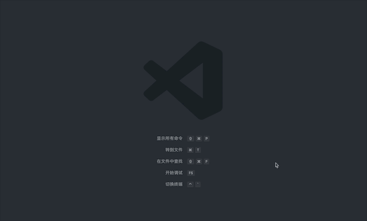

# Goto Package

Jump to selected package.json file in node_modules quickly.

## It looks like this:




## Features

### Available Commands

- `Go to selected package` or the default shortcut `F12` to jump to the package.json file.
- `Visit page of npm` to jump to the package page of npm.
- `Pick and go to a package` to pick a package in select box then jump to the package.json file.

### Available Configuration

These packages in select box are the dependencies in the package.json by default, you can make extension to collect all packages in node_modules:

``` json
    "GotoPackage.searchNodeModules": true
```

## Change Log

See change log [here](https://github.com/liajoy/vscode-goto-package/blob/master/README.md).
